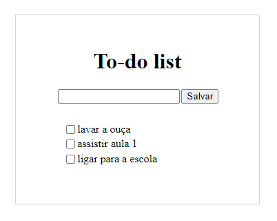

# Desafio To-Do List

## Proposta

- Crie um campo de input de texto e um botão para adicionar a tarefa à lista;
- Quando o botão for pressionado, o texto deve aparecer na lista com um checkbox ao lado;
- Quando o usuário selecionar o checkbox, o item correspondente deve ficar com o texto riscado.

O resultado esperado deve ser parecido com este:

O resultado atingido foi este:

Obs* diferentemente do projeto contador, optei por usar o método addEventListener() possibilitando um código mais limpo e objetivo.
